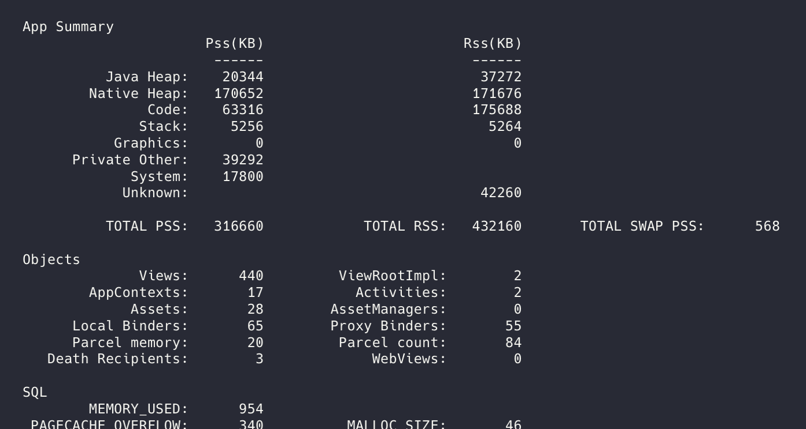
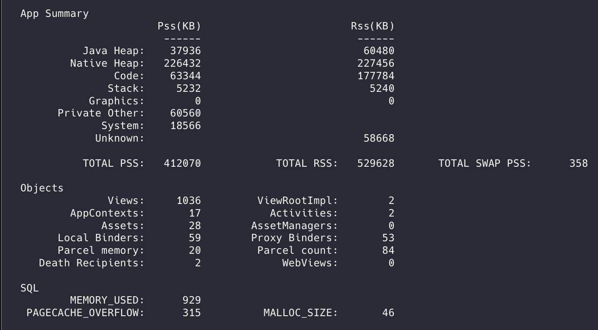
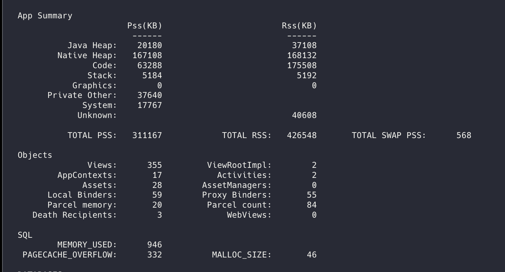
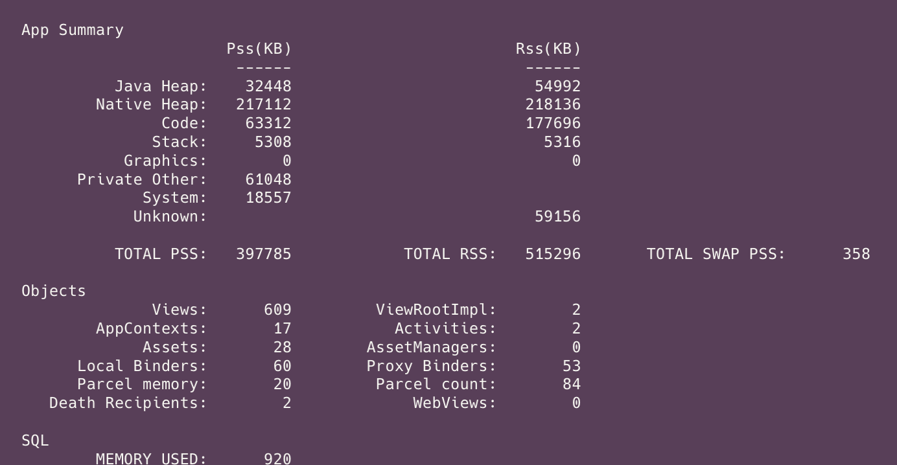

# React Native Fabric Text Benchmark: NativeText (View) vs. NativeVirtualText (Span)

This repository contains a performance benchmark and architectural proof-of-concept demonstrating the critical difference between **View-backed Text** (`NativeText`) and **Virtual-backed Text** (`NativeVirtualText`) in the React Native New Architecture (**Fabric**).

## 🚨 The Problem

In the **Old Architecture (Paper)**, React Native was lenient. You could nest a native View (e.g., a custom `NativeText` wrapping `UIView`/`TextView`) inside a Text component, and the layout engine would "hack" it into an `NSTextAttachment`, allowing it to wrap and flow inline with text.

In **Fabric (New Architecture)**, this behavior was removed for strict type safety and thread safety:
* **Views (`NativeText`)** are treated as atomic "Layout Boxes" (like images). They cannot break lines internally.
* **Virtual Nodes (`NativeVirtualText`)** are treated as "Text Spans". They flow, wrap, and merge into the parent paragraph.

This repo proves that using `NativeText` (Views) for inline content not only breaks layout wrapping but causes **massive performance degradation** due to excessive Native View allocation.

## 🧪 The Test Bench

The `(tabs/index).jsx` file allows you to toggle between two scenarios to stress-test the native memory heap:

* **🔴 Scenario A: Heavy (View-Based)**
    * Uses a custom `NativeText` component backed by a real `UIView` / `android.widget.TextView`.
    * Every text segment creates a new Native View instance.
* **🟢 Scenario B: Optimized (Virtual-Based)**
    * Uses `NativeVirtualText` backed by Fabric's `VirtualTextShadowNode`.
    * No Native Views are created for children; content is merged into the parent's text storage (C++).

### Setup & Run
1.  Clone the repo.
2.  Install dependencies: `yarn install` / `pod install`.
3.  Run the app: `npm run android` or `npm run ios`.
4.  Toggle between **Scenario A** and **Scenario B** using the buttons at the top.
5.  Scroll aggressively to force item creation.

## 📊 Benchmark Results

We ran this benchmark on Android with a list of **2,000 items**. The results were captured using `adb shell dumpsys meminfo host.exp.exponent` and are conclusive.

### 1. View Count Explosion (The "Smoking Gun")
* **Optimized:** ~600 Views (mostly FlatList containers).
* **Heavy:** ~1,000+ Views (Explosion of TextViews).
* **Impact:** The Heavy implementation forced the creation of **~427 extra native views** for the exact same visible content. This directly clogs the Main Thread (UI Thread), causing scroll stutter.

| Metric | Optimized (Virtual) | Heavy (Views) | Difference |
| :--- | :--- | :--- | :--- |
| **Initial Views** | 355 | 440 | +85 Views |
| **End of List Views** | **609** | **1,036** | **+427 Extra Views** |

### 2. Memory Usage (PSS & Native Heap)
* **Optimized PSS:** ~397 MB
* **Heavy PSS:** ~412 MB
* **Result:** A **~15 MB** increase in RAM usage just for using Views instead of Spans. On lower-end devices, this significantly increases the risk of OOM (Out of Memory) crashes.

### Evidence
*(Screenshots from `adb shell dumpsys meminfo`)*

#### Scenario A: Heavy (View Explosion)
***At Start***

***Scrolled to the end of the list***

> Note the `Views: 1036` count.

#### Scenario B: Optimized (Efficient)
***At Start***

***Scrolled to the end of the list***

> Note the `Views: 609` count.

## 🛠 Architectural Solution

To fix layout issues and solve this performance bottleneck, we use a **Context-based Wrapper**:

```javascript
// My offer
import { NativeText as TextView, NativeVirtualText } from 'react-native/Libraries/Text/TextNativeComponent';

export const NativeText = ({ children, ...props }) => {
  const isInsideText = useContext(TextAncestorContext);

  if (isInsideText) {
    // Child: Use Virtual Node (C++) -> Zero View Overhead
    return <NativeVirtualText {...props}>{children}</NativeVirtualText>;
  } else {
    // Root: Use Native View -> Layout Boundary
    return (
      <TextAncestorContext.Provider value={true}>
        <TextView {...props}>{children}</TextView>
      </TextAncestorContext.Provider>
    );
  }
};